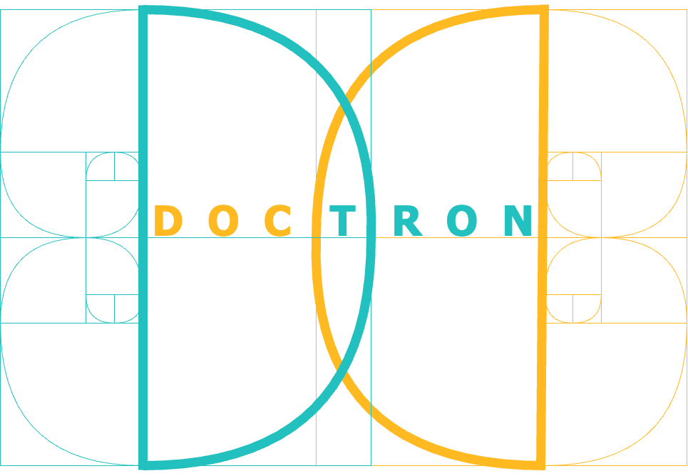
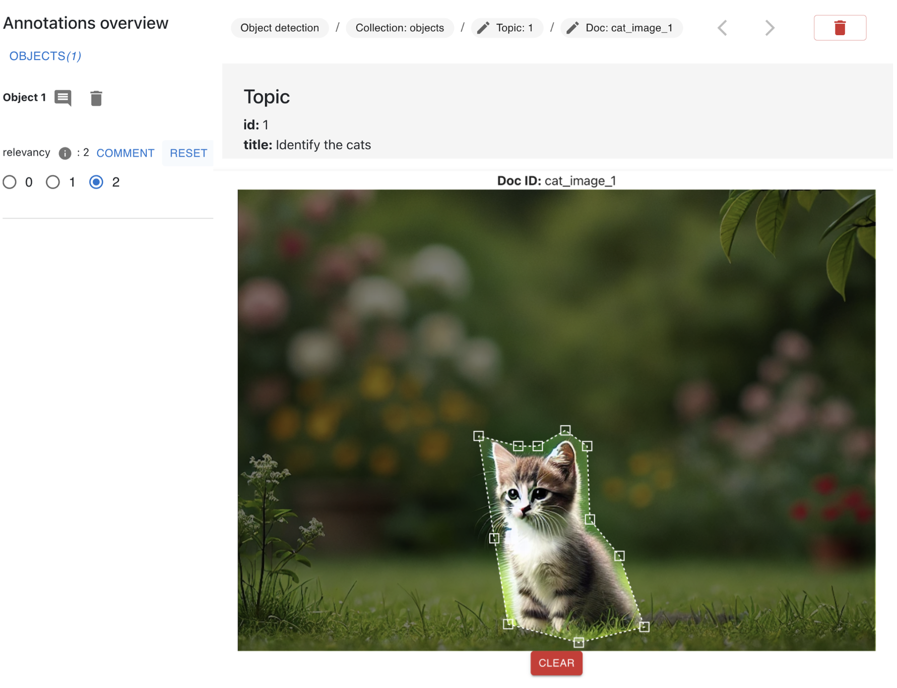

# DocTron version 1.0.0
<p align="center">
   
</p>
DocTron is an open-source, collaborative, web-based annotation targeting IR domain.  
All the source code, the installation guidelines, and instructions to use the tool are availanle in this repository.

DocTron has been published at SIGIR2025: *Doctron: A Web-based Collaborative Annotation Tool for Ground Truth Creation in IR*
DOI: 10.1145/3726302.3730286

## Requirements
A demo version of DocTron is available online at http://doctron.dei.unipd.it. Users can login with username and password "demo" and test DocTron functionalities.
In order to locally deploy DocTron in your computer or in a remote server you need Docker and docker-compose. To install them, you can follow the instructions available at: https://docs.docker.com/get-docker/ (Docker) and https://docs.docker.com/compose/install/ (docker-compose). 

Clone or donwload this repository. Open the **doctron** folder and, replace the url provided in the url.txt file with the url of the server where DocTron will be deployed. Your url must replace the default one: http://localhost:8000. 

Run a new terminal session and place inside ```backend``` folder --where there is the ```docker-compose.yml``` file-- and run 

```docker compose up```

This procedure will take few minutes depending on your hardware and you internet connection. When the procedure is finished you can open a new browser winodw (chrome is recommended) and you can start uploading new documents.
Once that DocTron is up and running, open a new terminal and run 

```docker compose exec db bash -c "psql -U postgres -tc \"SELECT 1 FROM pg_database WHERE datname = 'doctron_db'\" | grep -q 1 || psql -U postgres -c 'CREATE DATABASE doctron_db;' && pg_restore -U postgres -d doctron_db -v backup_db_2.tar"```

this will setup the database restoring the database schema and providing some test collections (those provided in the online demo instance).

## UI - User interface
In the annotation interface you can visualize your annotations and annotate collections' documents.
<p align="center">
   
</p>

   1. In the main header it is possible to logout, and access to collection and statistics dashboard pages;
   2. In the document header it is possible to check the annotation template chosen, the collection name, topic and document ids. The document and topic are buttons which allow the user to add some comments;
   3. The vertical toolbar which allows users to: change role, change document, topic and collection, check other users' annotations, get an overview of the statistics of the collection, customize colors and font, upload new documents, concepts, annotations, download the annotation, automatically annotate the documents (from A to J in the figure).
   4. The annotation panel on the left allows you to visualize you annotations performed and edit or remove them accordingly;
   5. The part of the page where the textual document is subdivided into topic and document infomation;

## Annotation templates 
DocTron provides 7 annotation templates you can use to annotate documents with respect to a topic. 
   1. **Graded labeling.** This annotation template consists of labels (e.g., relevance) associated with a range of values (e.g., integers from 0 to 3). Annotators must assign a value to each label, indicating that the label’s value is for the document concerning the specific topic. This template can be used for text-based and image-based topics and documents, as the graded labeling is applied at the document level and is not limited to specific sections of a text or portions of an image.
   2. **Passages annotation.** Passages are brief sections -—comprising one or more sentences—- within a textual document. Doctron allows users to identify these passages and annotate them accordingly. Users can select a passage by dragging from the first to the last character and then associate a graded label that indicates the significance of that passage concerning a topic. 
   3. **Entity tagging.** Entity tagging --or NER (Named Entity Recognition) consists in associating to the mentions --portions of text of some words identifiable in the textual document-- one or more labels, called tags --e.g., Person, Organization, Animal. In DocTron, to associate a tag to a mention, the mention has to be detected by dragging and dropping from the first to the last character of the mention. Then, it is possible to select the desired tag by clicking on the mention;
   4. **Entity linking.** Entity linking --or NER+L (Named Entity Recognition and Linking) consists in associating to the mentions the concepts belonging to a knowledge base. In DocTron, to associate a concept to a mention, the mention has to be detected by dragging and dropping from the first to the last character of the mention. Then, right clicking on the mention it is possible to open the concept panel where it is psosible to choose the concept or create a new one;
   5. **Relationships annotation.** A relationship is a triple composed of a subject, a predicate, and an object. At least one of them must be a mention in the textual document --either linked, tagged, or plain. For this reason it is a mention-level annotation template;
   7. **Facts annotation.** Facts are triples of concepts from a knowledge base, or tags composed of a subjects, a predicate and an object. In the same way as graded labeling, this a document level annotation type and is unlinked from the document being evaluated;
   8. **Objects detection.** An object is a portion of an image. To detect an object in an image in DocTron, users should identify the perimeter of the object. Objects can be associated with a graded label that identify the value of a label of the object with respect to the topic. An example is reported in the Figure above.
      
<p align="center">
   
</p>

## Statistics dashboard 
In the statistics dashborard, reachable by clicking on _Statistics_ button of the main header, you can visualize statistics related to the collections.
<p align="center">
   
</p>

   1. In the dashboard on the left it is possible to change collection basing on the annotation template;
   2. In the header it is possible to select which type of statistics to visualize --individual concern the single annotator, global concenr the entire set of annotators, while IAA contains an overview of the IAA metrics. In the image above there is an overview of the IAA metrics;
   3. Three cards provide an overview of the annotations;
   4. The table displays the Fleiss and Krippendorff’s alpha values for each document;
   5. The Coehn's Kappa is a symmetric matrix where for each pair of users (row and column) it is provided the Coehn's kappa value;


## Customizability and Collections
DocTron allows the users to create one or more  _collections_. A collection is characterized by three key elements: a _topic_ which identifies the information need; the _document_ which is the annotable unit which can be either a topic or an image; and an _annotation tempalte_ which is identifies how the document should be annotated.
All the documents can be annotated with respect to all the topics by all the member of a collection. 
Each member of the collection is an _annotator_ which has the default permission: they can annotate the documents. _Reviewers_ are allowed to review the annotations produced by the annotators; the _admins_ have the highest permissions: they can modify both reviewers' and annotators' annotations, they can check statistics of the collection and IAA metrics. Admins can keep track of the annotation workflow, define and refine guidelines and oversees the entire work of all the collection members. The workflow of annotation is provided in the Figure below.
<p align="center">
   
</p>

Collections can be _collaborative_ and _competititve_: in collaborative modality all the annotators can annotate the entire collection and have access to other members' annotations and majority voting based ground truth. In contrast, in competitive mode, annotators cannot see each other work. This is particularly relevant when it is important to assess the quality of the annotations and, if needed, establish new guidelines. 

To create a new collection go to COLLECTIONS button at the top of the main interface which will redirect to the collections page. This page contains the list of collections a user can annotate for each annotation template. By clicking on the **Add collection** button it is possible to create a new collection.
To create a new collection the following information should be provided: (i) name, (ii) description, (iii) a list of members who can annotate the collection. Some other files and information strictly depend on the annotation template of the collection. In graded labeling for example, users have to provide a set of labels and their range of values; the same holds of passages annotation and object detection where we annotate the passage (or object) of the document with respect to a topic. In relationships and facts annotation and in entity linking and tagging, the user has to provide the concepts and the tags respectively.
On the other hand, new documents, topics, concepts, tags can be added at any moemnt also during the annotation task.
When a new member is added, it will not be automatically able to annotate the collection: an invitation is sent to them, and then, once that they accept the invitation, they will be able to annotate the documents.
For what concerns the upload of topics and documents, DocTron is also integrated with two APIs to the automatic upload of textual documents.
- PubMed: it allows to upload automatically PubMed abstract by providing the PMID. The abstracts and other information as title, authors, publication date and venue will be available as annotable documents of the collection;
- ir-datasets: this integration allows to upload entire collections of documents by providing the URL of the collection as it is provided in ir-dataset websites. This will download the entire collection and make it available for annotation.

For documents not belonging to PubMed or to any collection in ir-datasets, they can be uploaded in several format as TXT, JSON, CSV, PDF. Documents are not required to have fixed structure, or mandatory fields.
Topics instead, should uploaded in JSON format. DocTron provides template for topics. 

The collections a user can annotate contain the following information: creator, date of creation, descriptions, documents, topics, number of annotators, annotators', reviewers', admins' names, labels list. It is possible to interact with the collections, in particular it is possible to:
1. load more information;
2. split the collection in equal parts distributing the same number of documents, topics or both to each annotator equally;
3. create an _honeypot_: a set of documents which are shared among all the users and are needed to evaluate the work of annotators on a set of shared docs. In this case the users do not know which are the selected documents. This common basis enables comparison of annotations, helping assess quality and ensure consistency. In  crowdsourcing, the honeypot provides a standardized reference point, improving the reliability of the dataset and helping identify discrepancies in annotations.
4. annotate the collection;
5. delete the collection.

Some of these features are accessible only by the admins --i.e., collection split, honeypot definition, invitation of new members or reviewers, delete of the collection.

<p align="center">
   
</p>

# Citation
If you use DocTron for your research work, please consider citing our paper:

  ```bibtex
@inproceedings{irrera_etal-2025,
  author    = {Ornella Irrera and
               Stefano Marchesin and
               Farzad Shami and
               Gianmaria Silvello},
  title     = {Doctron: A Web-based Collaborative Annotation Tool for Ground Truth Creation in IR},
  booktitle    = {Proceedings of the 48th International ACM SIGIR Conference on Research and Development in Information Retrieval, {SIGIR} 2025, Padua, Italy, July 13-18, 2025},
  url          = {https://doi.org/10.1145/3726302.3730286},
  doi          = {10.1145/3726302.3730286}
  year      = {2025}
}
```

# Credits

DocTron has been developed by the [Intelligent Interactive Information Access Hub (IIIA)](http://iiia.dei.unipd.it/) of the  [Department of Information Engineering](https://www.dei.unipd.it/en/), [University of Padua](https://www.unipd.it/en/), Italy.


## Acknowledgements 


This work was supported by [HEREDITARY](https://www.hereditary.eu/), European Union Horizon 2020 program under Grant Agreement no. 101137074.

## Contacts

Any questions? The authors are glad to answer your questions and receive your feedback or suggestions to further improve DocTron. 

- [Ornella Irrera](http://www.dei.unipd.it/~irreraorne) · ornella.irrera AT unipd.it
- [Stefano Marchesin](https://www.dei.unipd.it/~marches1/) · stefano.marchesin AT unipd.it
- Farzad Shami · farzad.shami AT studenti.unipd.it
- [Gianmaria Silvello](http://www.dei.unipd.it/~silvello/) · gianmaria.silvello AT unipd.it


